#Apache Hadoop QAT compression codec  

## 1. Overview 
 Data compression and compression formats can have a significant impact on performance. The important places to consider data compression are in MapReduce and Spark jobs, data stored in HBase, and hive queries. For the most part, the principles are similar for each. 
 
 You must balance the processing capacity required to compress and decompress the data, the disk IO required to read and write the data, and the network bandwidth required to send the data across the network. The correct balance of these factors depends upon the characteristics of your cluster and your data, as well as your usage patterns. 
 
 Hadoop supports the following existing compression types and codecs: 

* gzip - *org.apache.hadoop.io.compress.GzipCodec* 

* bzip2 - *org.apache.hadoop.io.compress.BZip2Codec* 

* LZO - *com.hadoop.compression.lzo.LzopCodec* 

* Snappy - *org.apache.hadoop.io.compress.SnappyCodec* 

* Deflate - *org.apache.hadoop.io.compress.DeflateCodec* 

As the complexity of applications continues to grow, systems need more and more computational resources for workloads, including data compression. 

Intel&reg; QuickAssist Technology can improve performance and efficiency across the data center by offloading servers from handling compute-intensive operations. By including Intel&reg; QuickAssist Technology in big data environment, it can increase efficiencies for applications that use compression acceleration. In this document, we see implementation of QAT codec for Apache Hadoop and its usage details. Below is the QAT Codec class for Apache Hadoop Mapreduce
 	
* QAT - *org.apache.hadoop.io.compress.QatCodec* 

## 2. Hadoop MR Compression Configurations
These below are the configurations for Mapreduce compression

*	*mapreduce.output.fileoutputformat.compress* - It takes the value as true or false, true denotes that M/R Job outputs should be compressed. It is applicable only when the M/R Job uses FileOutputFormat or its subclasses/associated formats. 

*	*mapreduce.output.fileoutputformat.compress.codec* ¨C It takes fully qualified class name as the value, i.e. codec class name for the compression type. If the fileoutputformat compression is enabled then it decides how they should be compressed using this parameter. It is applicable only when the M/R Job uses FileOutputFormat or its subclasses/associated formats. 

*	*mapreduce.map.output.compress* - It takes the value as true or false, true denotes that the outputs of the maps be compressed before being sent across the network. Uses SequenceFile compression. 

*	*mapreduce.map.output.compress.codec* - It takes fully qualified class name as the value, i.e. 
codec class name for the compression type. If the map outputs are compressed, it decides how they should be compressed. 

If the Job has any custom input/output formats and they want to get the benefit of compression codec, they should have corresponding codec usage implementation in the custom input/output format similar to the FileInputFormat/FileOutputFormat. 

##3. Compression/Decompression in Mapreduce Pipeline 
The below diagram explains the Mapreduce pipeline with compression/decompression during the Job input reading, Job Output writing and shuffle handling. 

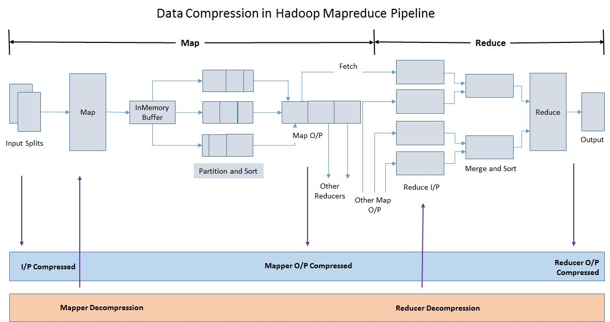

Mapreduce typically compresses/decompresses in the below three phases, i.e. compresses while writing Job O/P (i.e. reducers O/P) and during the shuffle data transfer to the Reducers. It decompresses while reading the Job I/P by the Mappers and also while getting the shuffle data from the Mappers to the reduce phase. 

* Job Input Data Reading 

If the input files are compressed, they will be decompressed automatically as they are read by MapReduce, using the filename extension to determine which codec to use. The configured Job InputFormat should have support for decompressing automatically, 
FieInputFormat and its associated classes support the automatic decompression if the input is compressed. 

* Job Output Data Writing 

If we want to save the space for storing the Job O/P, we can enable it in the MR Job O/P Format. If the Job is using the FieInputFormat or its associated classes, compression codec can 
be enabled using the mapreduce.output.fileoutputformat.compress, mapreduce.output.fileoutputformat.compress.codec configurations. 

* Shuffle Data transfer 

It's very common to enable MapReduce intermediate compression, since this can make jobs run faster without you having to make any application changes. Only the temporary intermediate files created by Hadoop for the shuffle phase are compressed (the final output may or may not be compressed based on the configuration). 

## 4. QAT Compression in Apache Hadoop Mapreduce 

The below diagram shows the utilizing the capability of QAT from QAT Hardware to the Mapreduce Job using QAT codec, QATzip and Driver. 

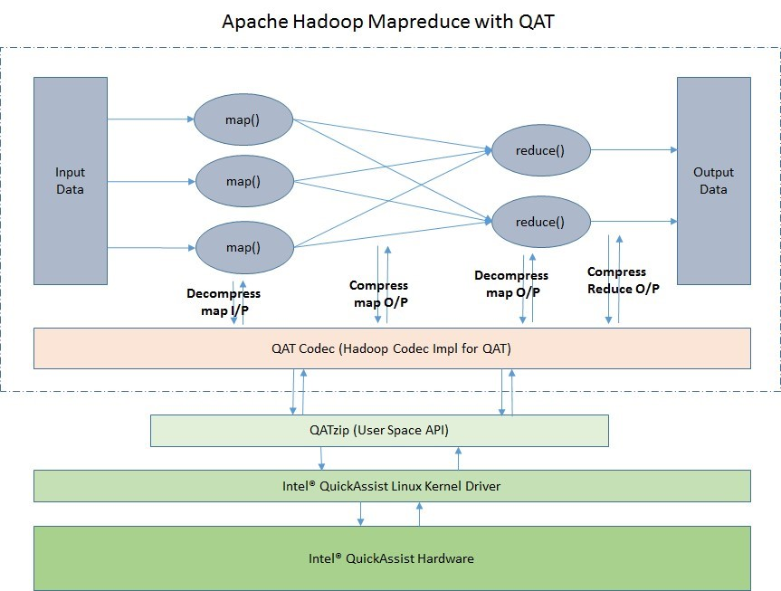

###4.1 Intel&reg; QuickAssist Hardware 

Intel&reg; QuickAssist Technology improves performance and efficiency across the data center by offloading servers from handling compute-intensive operations.   

Server, networking, big data, and storage applications use Intel&reg; QuickAssist Technology for: 
*	Bulk cryptography: symmetric encryption and authentication, and cipher operations  

*	Public key cryptography: asymmetric encryption, digital signatures, and key exchange 

*	Compression: lossless data compression for data in flight and at rest 
###4.2 Intel&reg; QuickAssist Linux kernel driver 
Intel&reg; QuickAssist Linux kernel driver provides native connectivity to the Linux Kernel Crypto/Compression Framework. 

###4.3 QATzip (User space library) 
QAT user space library offering Intel? QuickAssist Technology Functional API for application porting. 

###4.4 QAT Codec
QAT Codec is the implementation of Apache Hadoop Compression interfaces and utilizes the QATZip library for buffer allocation, compression and decompression. 

####4.4.1 QAT Codec Compression 
The below diagram shows the sequence of invocations for performing the compression in MR Job using the QATzip library. 

MR Job map/reduce creates an instance of the Codec (i.e. QATCodec) if it is not already created. Using QATCodec instance, MR Job creates an OutputStream by giving the actual data output stream. QATCodec creates the compressed and decompressed buffers suing the qzMalloc from QATZip if the native allocation is enabled, otherwise it creates in the traditional way. After getting the compressed output stream, it invokes compression for every buffer fill till the end of the data. QATCompressor invokes the qzCompress API for each compression invocation and compresses the data. 

####4.4.2 QAT Codec Decompression 
The below diagram shows the sequence of invocations for performing the decompression in MR Job using the QATzip library. 

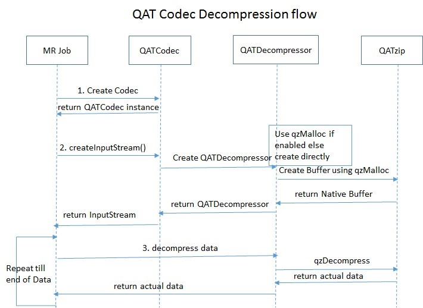

MR Job map/reduce creates an instance of the Codec (i.e. QATCodec) if it is not already created. Using QATCodec instance, MR Job creates an InputStream by giving the compressed data input stream. QATCodec creates the compressed and decompressed buffers suing the qzMalloc from QATZip if the native allocation is enabled, otherwise it creates in the traditional way. After getting the decompressed input stream, it invokes decompression for every buffer fill till the end of the data. QATDecompressor invokes the qzDecompress API for each decompression invocation and decompresses the data. 

##5. Deployment

Download the Hadoop QAT Wrapper/Codec release and extract it. You can follow any one of the below/applicable way to configure it. 

* Cloudera Parcel Installation 

Find the qat codec parcel in the release and install it as per the parcel installation procedure. 

* Copy the jar file and .so file in the appropriate location of Cloudera installation in all the nodes 
    1. Copy the *hadoop_qat_codec\*.jar* file to *$HADOOP_COMMON_HOME/*    
    2. Copy the *libqatcodec.so* file to *$HADOOP_COMMON_HOME/lib/native* 

* Using Cloudera Manager
    1. Copy the *hadoop_qat_codec\*.jar* and *libqatcodec.so* file to same location in all the nodes in the cluster     
    2. Add the location of *hadoop_qat_codec\*.jar* to *mapreduce.application.classpath* or *yarn.application.classpath* in the Cloudera Manager Web UI.     
    3. Add the location of *libqatcodec.so* file *mapreduce.admin.user.env* in the Cloudera Manager Web UI. 
 
* Copy the jar file and .so file in the appropriate location of standalone installation 
    1. Copy the *hadoop_qat_codec\*.jar* file to *$HADOOP_COMMON_HOME/share/hadoop/common* 
    2. Copy the *libqatcodec.so* file to *$HADOOP_COMMON_HOME/lib/native* 

* Configuring in *mapred-site.xml*
    1. Copy the hadoop_qat_codec*.jar and libqatcodec.so file to the same location in all the nodes in the cluster 
    2. Add the location of hadoop_qat_codec*.jar to mapreduce.application.classpath in mapred-site.xml or yarn.application.classpath in yarn-site.xml. 
    3. Add the location of libqatcodec.so file to mapreduce.admin.user.env in mapredsite.xml. 

 ##6. Configurations to enable QAT Compression 
 ###6.1 Mapreduce Configurations 
    * mapreduce.output.fileoutputformat.compress=true 
    * mapreduce.output.fileoutputformat.compress.codec=org.apache.hadoop.io.compress.QatCo dec 
    * mapreduce.map.output.compress=true 
    * mapreduce.map.output.compress.codec=org.apache.hadoop.io.compress.QatCodec 

These configurations can be set using any one of these ways:
    1.	Configure the above parameters using Cloudera manager 
    2.	Passing as part of the Job Submission command using *-D<param-name>=<param-value>*. 
    3.	Using the method *Configuration.set(String name, String value)* in MR Job. 
    4.	Updating the configurations in *mapred-site.xml* file. 
    
###6.2  QAT Codec configurations   
    * io.compression.codec.qat.use-native-allocate-bb 
  Whether to enable creating the ByteBuffer using qzMalloc, default value is false. 
   
    * io.compression.codec.qat.native-allocate-bb.force-pinned 
  Whether to enable the force-pinned for qzMalloc, default value is true. It is applicable only when the *io.compression.codec.qat.use-native-allocate-bb=true*. 
   
    * io.compression.codec.qat.native-allocate-bb.numa 
  Whether to enable the numa for qzMalloc, default value is false. It is applicable only when the *io.compression.codec.qat.use-native-allocate-bb=true*. 

These configurations can be set using any one of these ways, 
 
   1.   Passing as part of the Job Submission command using *-D<param-name>=<param-value>*. 
   2.   Using the method *Configuration.set(String name, String value)* in MR Job. 
   3.   Updating the configurations in *mapred-site.xml* file. 
   
##7. Hive Compression Overview 
For the compression in Hive, user can compress not only the intermediate data at HDFS during the execution but also the final output data when doing ETL. For both these two scenarios, the data format layer handles the compression job. 

##8. Hive Compression Configuration 
For the intermediate data, users can specify the data format for the intermediate data by "hive.exec.compress.intermediate" and "hive.intermediate.compression.codec" to specify the compression codec. 

For the output result, users can specifying the compression mode at the creation of a table when using external data format like Parquet, ORC and AVRO and property "hive.exec.compress.output" for internal data format like TextFile. We will discuss the detailed usage for external data format in the section "Compression/decompression in data format".

##9. Hive Compression/decompression workflow 
###9.1 Overview

 
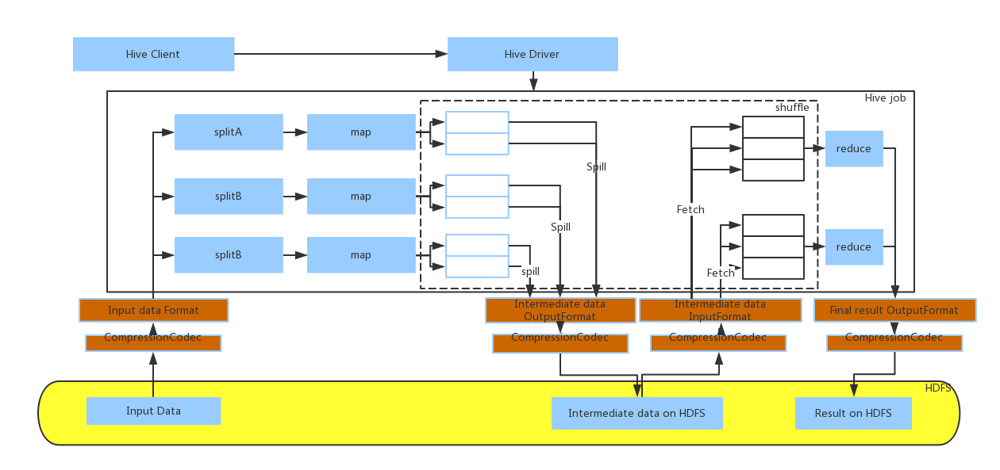

 This picture above is showing the basic workflow of a Hive job. Compression related part is highlighted in gray color. Hive Client triggers Hive job via Hive Driver. (1) For Hive job, it uses the Compression codec from the input format to decompress the original input split. (2) And when doing the shuffle, Hive will use the compression codec from the output format of the intermediate data to compress the spilled data and do the decompression using the codec from the input format for the intermediate data. (3) When job is complete, the result will sink into the HDFS compressed by the codec specified by the output data format. In summary, compression/decompression are handled by the output/input format for both intermediate data and final output data. 

###9.2 Compression/decompression for final output format 
The following picture is showing how Hive compresses the final output data after reduce stage. For the final output format, the compression/decompression are handled by compression codec from the corresponding data format. And for data types like TextFile, Sequence file, they can use QAT compression codec by specifying it in Hive conf. For other external data formats like ORC, Parquet and Avro, it requires changes from the code level since the data formats don¡¯t support to set compression codec via configuration directly. 

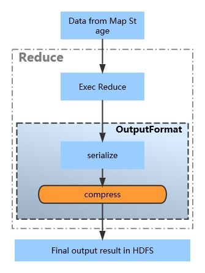

###9.3 Compression/decompression for intermediate data 
The following picture is showing how Hive compress/decompress the intermediate data. The supported data format for intermediate data don't include ORC, Parquet and AVRO. As discussed in last section, for data formats like TextFile and Sequence File, they can leverage existing Hadoop QAT compression codec directly. 

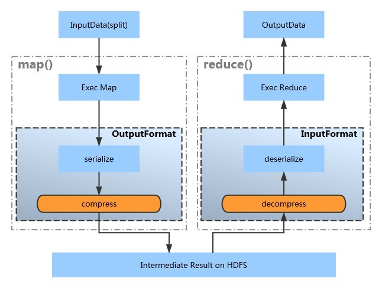

##10. Compression/decompression in data format 

As discussed in previous section, decompression/compression are handled by data format. This section will show how it works at data format level (ORC and Parquet) in a detailed way. As ORC and Parquet can only be supported as final output format, this section will only discuss the final output data compression use case. 

###10.1 ORC

####10.1.1 Compression

#####10.1.1.1 Usage

  1. Choose the compression algorithm for ORC file  
   Set orc.compress=QAT in Hive client side or set this environment value in the table properties when creating the table as ORC data format.  
  
  2. Compress data  
  After the related properties are set correctly, the final output data in ORC data format will be compressed. 

#####10.1.1.2 Internal Workflow 
The following pictures discusses how ORC does the compression using QAT codec. The compression algorithm is stored in configuration. When FileSinkOperator tries to sink data as ORC data format. The OrcRecordWriter will use the compression codec to compress original data into HDFS. 

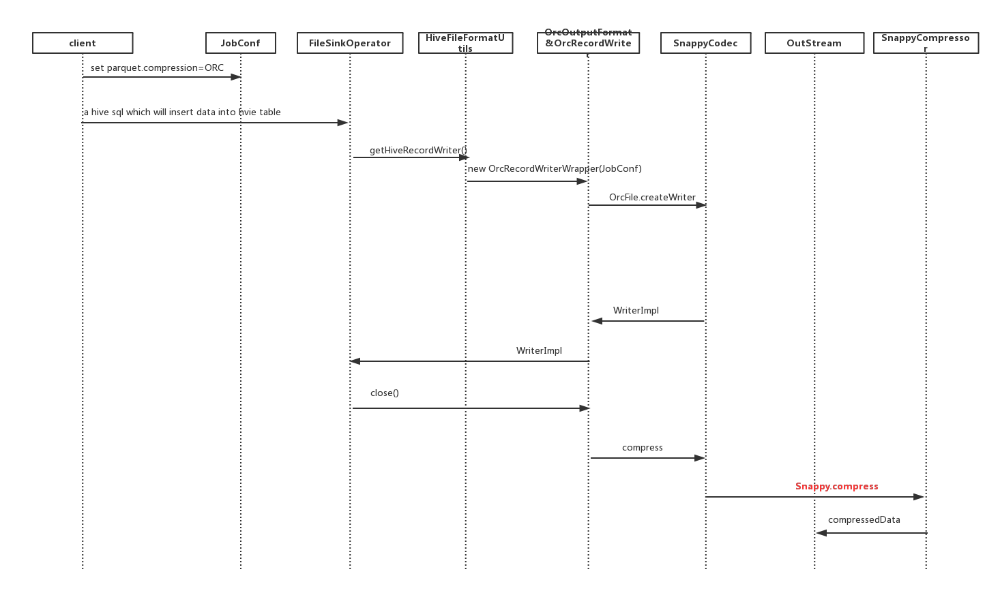

####10.1.2 Decompression 
#####10.1.2.1 Internal Workflow 
The following pictures discusses how ORC does the decompression using QAT codec. Orc reader from OrcInputFormat detects the compression algorithm by file extension to do the decompression work. 

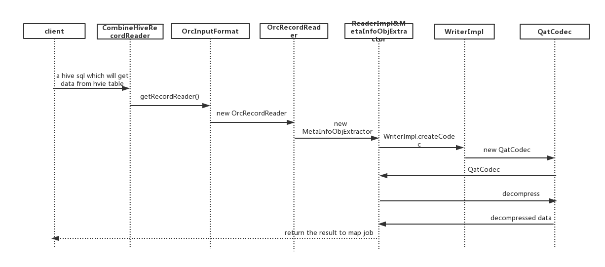

#####10.1.2.2 Class Diagram 
For ORC in CDH, it's implemented in Hive. And the following picture discusses the class diagram of QAT codec. 

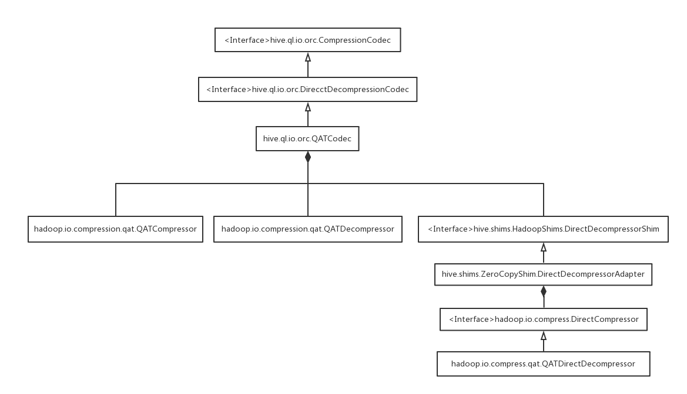

###10.2 Parquet 
####10.2.1 Compression 
#####10.2.1.1 Usage 
 1. Choose the compression algorithm for PARQUET file. set parquet.compress =QAT in Hive client side or set this environment value in the table properties when creating the table stored as PARQUET file. 
 
 2. Compress data.  
 After the related property has already set to correct value, the data will be compressed in PARQUET file. 

#####10.2.1.2 Internal Workflow 
The following pictures discusses how Parquet does the compression using QAT codec. Similar to ORC, FileSinkOperator uses the compression codec specified by the configuration to do the compression and sink data finally into HDFS.  

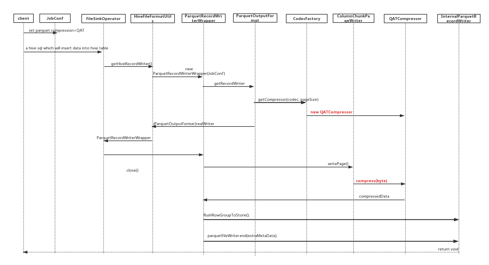

####10.2.2 Decompression 
#####10.2.2.1 Internal Workflow 
The following pictures discusses how PARQUET does the decompression using QAT codec. Similar to ORC, the compression algorithm is also detected by file extension. By using the codec from ParquetInputFormat, compressed data will be processed by specified compression codec. 

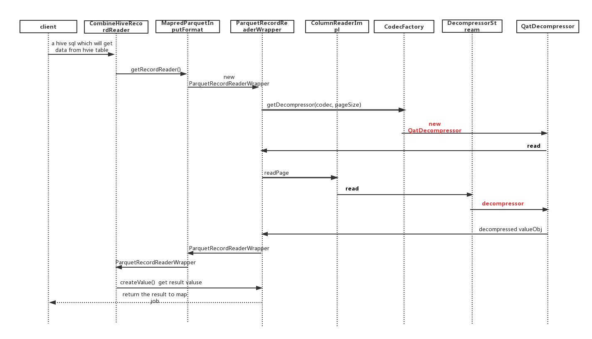

##11. Spark Compression Overview 
Spark supports the following existing compression types and codecs to compress internal data such as RDD partitions, event log, broadcast variables and shuffle outputs: 

* lz4 - *org.apache.spark.io.LZ4CompressionCodec* 
* lzf - *org.apache.spark.io.LZFCompressionCodec* 
* snappy - *org.apache.spark.io.SnappyCompressionCodec* 
* zstd - *org.apache.spark.io.ZstdCompressionCodec* 

In this document, we see implementation of QAT codec for Apache Spark and its usage details. Below is the QAT Codec class for Apache Spark shuffle, 

* QAT - *org.apache.spark.io.QatCompressionCodec* 

##12. Spark Shuffle Compression Configurations 
These below are the configurations for Spark Shuffle compression: 
* *spark.shuffle.compress* - It takes the value as true or false, true denotes that compress map output files. The default value is true. 
* *spark.shuffle.spill.compress* - It takes the value as true or false, true denotes that compress data spilled during shuffles. The default value is true. 
* *spark.broadcast.compresss* - It takes the value as true or false, true denotes that compress broadcast variables before sending them. The default value is true. 
* *spark.rdd.compress* - It takes the value as true or false, true denotes that compress serialized RDD partitions (e.g. forStorageLevel.MEMORY_ONLY_SER in Java and Scala or StorageLevel.MEMORY_ONLY in Python). The default value is false. 
* *spark.io.compression.codec* - It takes fully qualified class name as the value, i.e. codec class name for the compression type used to compress internal data such as RDD partitions, event log, broadcast variables and shuffle outputs. You should set this value to org.apache.spark.io.QatCompressionCodec to enable QAT compression for Spark shuffle. 

##13. QAT Compression in Apache Spark 
The below diagram shows the utilizing the capability of QAT from QAT Hardware to the Spark Job using QAT codec, QATzip and Driver. 

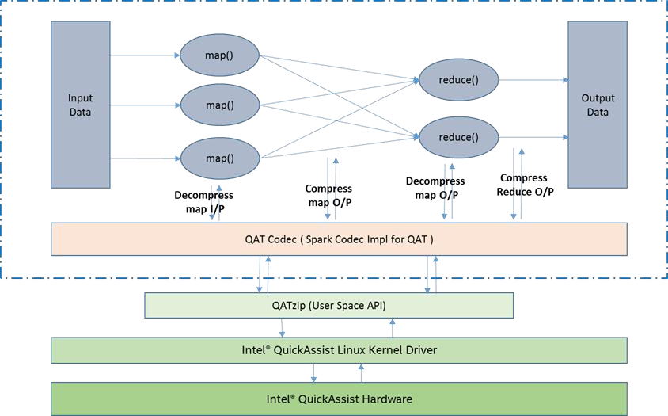

###13.1 Spark QAT Codec Compression 
The below diagram shows the sequence of invocations for performing the compression in Spark Job using the QATzip library. 

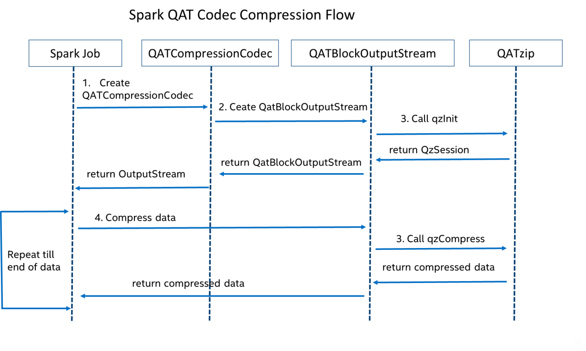

Spark Job creates an instance of the QatBlockOutputStream. Using QatBlockOutputStream instance, Spark Job creates an OutputStream by giving the actual data output stream. 

QatBlockOutputStream creates the compressed and decompressed buffers using the pooled direct ByteBuffer to reuse the direct ByteBuffer. After getting the compressed output stream, it invokes compression for every buffer fill till the end of the data. QatBlockOutputStream invokes the qzCompress API for each compression invocation and compresses the data

###13.2 Spark QAT Codec Decompression 
The below diagram shows the sequence of invocations for performing the decompression in Spark Job using the QATzip library. 

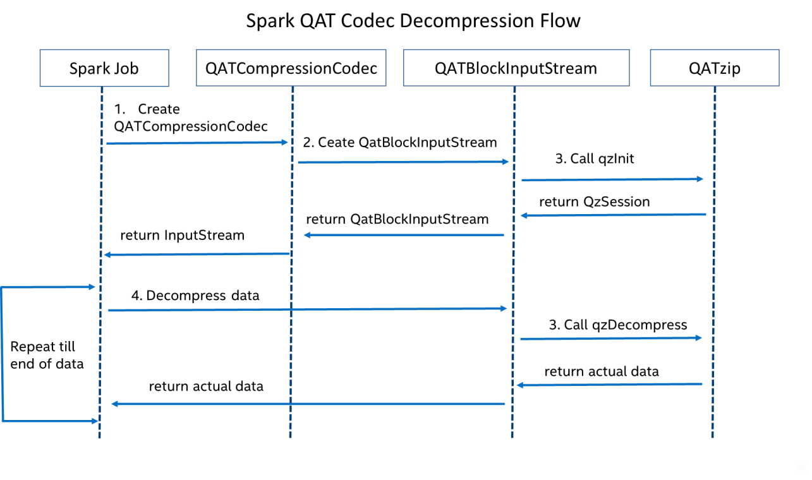

Spark Job creates an instance of the QatBlockInputStream. Using QatBlockInputStream instance, Spark Job creates an InputStream by giving the compressed data input stream. QatBlockInputStream creates the compressed and decompressed buffers using the pooled direct ByteBuffer to reuse the direct ByteBuffer. After getting the decompressed input stream, it invokes decompression for every buffer fill till the end of the data. QatBlockInputStream invokes the qzDecompress API for each decompression invocation and decompresses the data. 

##14. Spark Deployment 
Download the Spark QAT Wrapper/Codec release and extract it. You can follow any one of the below/applicable way to configure it. 

* Cloudera Parcel Installation 

  Find the spark qat codec parcel in the release and install it as per the parcel installation procedure. 
* Copy the jar file in the appropriate location of Cloudera installation in all the nodes 
  1. Copy the spark_qat_codec*.jar file to $SPARK_HOME/lib 

* Using Cloudera Manager 
  1. Copy the *spark_qat_codec*.jar* to same location in all the nodes in the cluster 
  2. Add the location of *spark_qat_codec\*.jar* to spark.driver.extraClassPath  and  spark.executor.extraClassPath in the Cloudera Manager Web UI. 
 
* Copy the jar file in the appropriate location of standalone installation 
  1. Copy the spark_qat_codec*.jar file to $SPARK_HOME/lib 

* Configuring in *spark-defaults.conf* 
  1. Copy the *spark_qat_codec\*.jar* to the same location in all the nodes in the cluster 
  2. Add the location of *spark_qat_codec\*.jar* to spark.driver.extraClassPath  and  spark.executor.extraClassPath in *spark-defaults.conf*.
  
##15. Spark Configurations to enable QAT Compression 
###15.1 Spark Shuffle Configurations 
  	* spark.shuffle.compress=true 
    * spark.io.compression.codec = org.apache.spark.io.QatCompressionCodec 
   
These configurations can be set using any one of these ways, 
   
  1. Configure the above parameters using Cloudera manager 
  
  2. Passing as part of the Job Submission command using --conf \<param-name\>=\<paramvalue\>.
   
  3. Using the method *SparkConf.set(String name, String value)* in Spark Job. 
  
  4. Updating the configurations in *spark-defaults.conf* file. 

###15.2 Spark QAT Codec configurations 
   * *spark.io.compression.qat.level*    
   The compression codec level used to compress data, default value is 1. 
   
   * *spark.io.compression.qat.blockSize* the maximum number of bytes to try to compress/decompress at once, default value is 1M. 
   
   * *spark.io.compression.qat.useNativeBuffer*  
    Whether to enable creating the ByteBuffer using qzMalloc, default value is false. 
 
These configurations can be set using any one of these ways: 

  1. Passing as part of the Job Submission command using --conf <param-name>=<paramvalue>. 
  
  2. Using the method SparkConf.set(String name, String value) in Spark Job. 
  
  3. Updating the configurations in spark-defaults.conf file. 

##16. Build the hive modules for QAT 

1. Run the Script 
  
         $./apply_hive_jar.sh  CDH_release_version  [PATH/TO/QAT_Codec_SRC]
   After this, we can see that in the folder under columnar_format_qat_wrapper/target, there have three parts: (1) parquet-format (2) parquet-mr (3) hive

2. Install Thrift
    1. Install the dependencies of C++
        
            $ sudo yum install automake libtool flex bison pkgconfig gcc-c++ boost-devel libevent-devel zlib-devel python-devel ruby-devel openssl-devel
    2. Clone the source file of thrift form github  
          
            $ git clone https://github.com/apache/thrift
    3. Config, build and install thrift 
  
           $ cd thrift
           $ ./bootstrap
           $ ./configure
           $ make
           $ sudo make install
    4. Check the thrift version (optional)   

           $ thrift -version

3. Build Parquet-format with Maven  
        
       $ cd parquet-format/
       $ mvn package

4. Build Parquet-MR with Maven  
Parquet-MR uses Maven to build and depends on both the thrift and protoc compilers. We have build and install thrift on step 2, so we only need to build and install protobuf.
    1. Build and install the protobuf compiler, run:

           $ wget https://github.com/google/protobuf/releases/download/v2.5.0/protobuf-2.5.0.tar.gz
           $ tar xzf protobuf-2.5.0.tar.gz
           $ cd  protobuf-2.5.0
           $ ./configure
           $ make
           $ sudo make install
           $ sudo ldconfig
   2. cd parquet-mr and build it

           $ cd parquet-mr
           $ LC_ALL=C mvn clean install

5. Build hive with Maven

        $ cd hive		
        $ mvn clean package -Pdist 

6. Copy the jar to CDH
   1. parquet-format     
    PATH/TO/QATCodec/columnar_format_qat_wrapper/target/parquet-format/target/parquet-format-2.3.1-cdh6.2.1.jar
   2. parquet-hadoop-bundle
      PATH/TO/QATCodec/columnar_format_qat_wrapper/target/parquet-mr/parquet-hadoop-bundle/target/parquet-hadoop-bundle-1.9.0-cdh6.2.1.jar
   3. hive-orc
      PATH/TO/QATCodec/columnar_format_qat_wrapper/target/hive/orc/target/hive-orc-2.1.1-cdh6.2.1.jar
   4. hive-exec
      PATH/TO/QATCodec/columnar_format_qat_wrapper/target/hive/ql/target/hive-exec-2.1.1-cdh6.2.1.jar

##17. References 
 
* Intel&reg; QuickAssist Technology Overview and applications -  https://www.intel.com/content/www/us/en/embedded/technology/quickassist/overview.html 
* Hadoop with Intel&reg; QuickAssist Technology -  https://www.intel.com/content/dam/www/public/us/en/documents/infographics/fasterhadoop-run-times-quickassist-technology.pdf 
